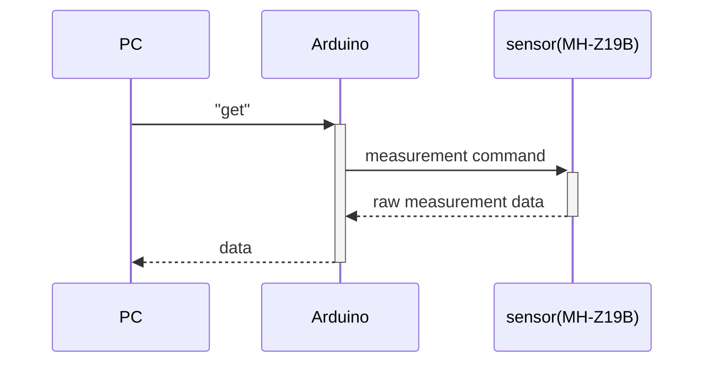

# arduino_gtest_sample

C++ GoogleTest sample for Arduino farmware. **Cannot compile for AVR like Arduino Uno because using C ++ STL in this project.** This project assumes that be compiled for Raspberry Pi Pico.

## Sample Project Overview

A module made in this project communicates with PC to CO2 sensor(MH-Z19B). Receives a "get" command from PC, returns data obtained from sensor.

### Scenario



## Test architecture

In the unit test for the microcomputer, it is important to separate the untestable module part such as device communication and the testable logic part. Using dependency injection, make the untestable part mock in the test.

The untestable parts are implemented as "[impl](src/impl)" class to abstract class. "impl" class is excluded in the test. See [CMakeLists.txt](CMakeLists.txt).

**`CMakeLists.txt`**

```cmake
list(FILTER SRC_FILES EXCLUDE REGEX ".*impl.cpp")
```

## License

MIT License

## Author

[toms74209200](<https://github.com/toms74209200>)
