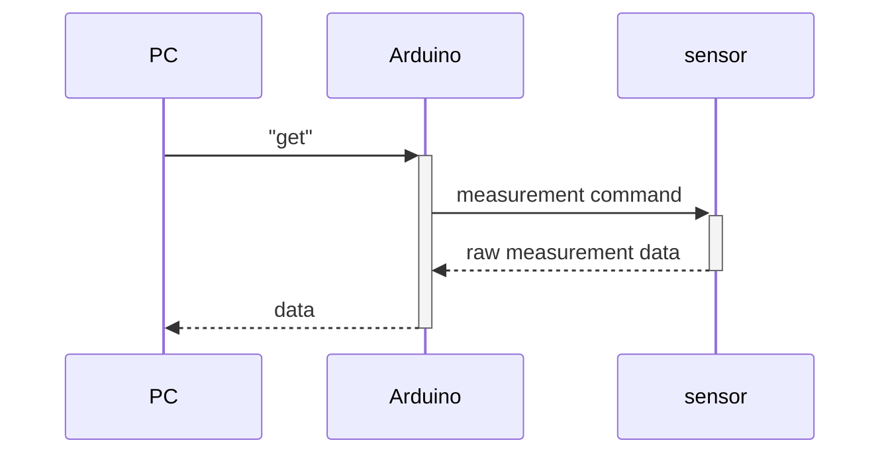

# arduino_gtest_sample

C++ GoogleTest sample for Arduino farmware.

## Sample Project Overview

### Scenario

## License

MIT License

## Author

[toms74209200](<https://github.com/toms74209200>)

